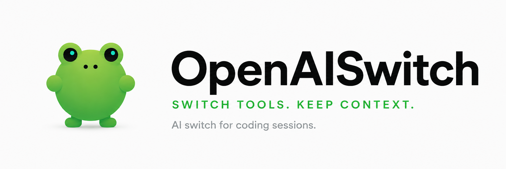

# openaiswitch — website

<p align="center">
  
</p>

<p align="center">
  <a href="https://www.openaiswitch.com"></a>
  <a href="https://github.com/reigpol/openaiswitch"></a>
  <a href="LICENSE"></a>
</p>

Marketing site for **[openaiswitch](https://github.com/reigpol/openaiswitch)** — switch AI coding CLIs without losing context. The CLI is `ais`.

**Live:** [www.openaiswitch.com](https://www.openaiswitch.com)

## What’s here

Static landing only — no build step:

| File | Role |
| --- | --- |
| `index.html` | Structure and copy |
| `styles.css` | Dark / light theme (OpenClaw-inspired shell, frog greens) |
| `main.js` | Theme toggle, nav, interactive `ais resume` hero |
| `assets/` | Logo and banner |

## Preview locally

```bash
python3 -m http.server 8765
# open http://127.0.0.1:8765/
```

Any static server works; open `index.html` via HTTP so assets and scripts load cleanly.

## Deploy

Static files at the repo root. Production is **[www.openaiswitch.com](https://www.openaiswitch.com)**.  
You can also preview from GitHub Pages (`main` / `/`) if that is enabled on the repo.

## Related

- **Product / CLI:** [reigpol/openaiswitch](https://github.com/reigpol/openaiswitch)
- **Website (this repo):** [reigpol/openaiswitch_web](https://github.com/reigpol/openaiswitch_web)

## License

[MIT](LICENSE) — same terms as openaiswitch.
